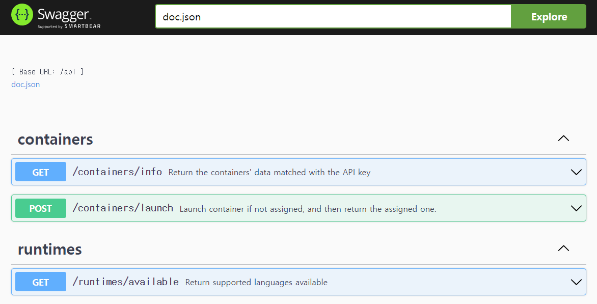

# Runtime-Bridge

**Runtime-Bridge** manages the allocations of containers used to execute codes remotely from [web IDE](https://github.com/Together-Coding/Client). It launches an [AWS Fargate](https://aws.amazon.com/fargate/) container for each user on request, and returns its public IP address and port number through which the user can access the container.

This server also provides reverse proxy using NGINX to allow the users to access the container using HTTPs connection.


## What it does

### `/api/containers/launch`

Identify the user with JWT in the request header. If a container is already allocated, return its information. Otherwise, launch new AWS Fargate container by calling AWS SDK for ECS and wait until it has an ENI(Elastic Network Interface) to get public IP address.

After public IP is attached to it, runtime-bridge sends ping to the [runtime-agent](https://github.com/Together-Coding/runtime-agent) inside of the container periodically until it responses. When runtime-bridge receives it, it sends another POST request to initialize the agent server. Lastly, it stores initialized data (e.g. username and password used for SSH) into the database, and responds to the requesting user with IP address and port number of the container.

### `/api/containers/info`

Use an API key in the request header that is unique to all containers to retrieve whose container sends the request. If the container is in an available status, return its information for [runtime-agent](https://github.com/Together-Coding/runtime-agent) to connect SSH locally.

### `/api/runtimes/available`

Return available languages that [runtime-containers](https://github.com/Together-Coding/runtime-container) have prepared for.


## Reverse proxy for the container

```plaintext
location ~ /([0-9\.]+)/(\d+)/(.*/?) {
    ...
    set $target http://$1:$2/$3$is_args$args;
    proxy_pass $target;
    ...
}
```

In `nginx.conf`, there is a reverse proxy configuration in order to allow users to connect to their containers using HTTPs.
Unfortunately, this reverse proxy rule works for any public IP address and port number regardless of whether they are of a container or not.


## Note:

It would be more appropriate and more secure to launch a container in a private subnet. If implemented like this, it may eliminate the waiting time spent to get the public IP at launch.  
Because there is NGINX server providing reverse proxy to the containers, it is also possible to forward users' requests to the containers that are in the private subnet. In this case, you can rewrite the target URL (`$target` in `nginx.conf`) to forward requests only to the subnet area, which is more strict and less vulnerable way.


## Requirements

- go 1.17.6


## Development

1. Copy and modify dotenv file  
    `$ cp .env.example .env`
2. Start server  
    `$ gin --port 8080 run main.go --all`


## Deployment

1. Build app  
    `$ GOOS=linux GOARCH=amd64 go build -o app .`
    > You may need to change `GOARCH` to suit your server.
2. Copy created executable to a server. For instance, you can use `scp`.  
    `$ scp -i <key_path> ./app <username>@<ip_addr>:/path/to/app`
3. Run executable in the server:  
    `$ PORT=8080 GIN_MODE=release /path/to/app`
4. Make sure you have configured NGINX at `/etc/nginx/...`  
    > configuration files may exist in several places. See [here](https://docs.nginx.com/nginx/admin-guide/basic-functionality/managing-configuration-files/) for more details.


## API document

API documents are generated by [gin-swagger](https://github.com/swaggo/gin-swagger). To update the documents, run `$ swag init`.




## DB Migration

For database migration, I used [golang-migrate](https://github.com/golang-migrate/migrate). It would be helpful to Check [CLI document](https://github.com/golang-migrate/migrate/tree/master/cmd/migrate#with-go-toolchain) too.

1. Install golang-migrate CLI as a root  
    ```bash
    $ curl -L https://packagecloud.io/golang-migrate/migrate/gpgkey | apt-key add -
    $ echo "deb https://packagecloud.io/golang-migrate/migrate/ubuntu/ $(lsb_release -sc) main" > /etc/apt/sources.list.d/migrate.list
    $ apt-get update
    $ apt-get install -y migrate
    ```
2. When you want to modify DB schema, create migration scripts  
    ```bash
    $ migrate create -ext sql -dir db/migrations -seq <title>
    ```
3. Write DDL at the created up/down.sql files
4. Run a migration  
   ```bash
   # This example is only applicable for Mysql and MariaDB.
   $ migrate -verbose -database "mysql://<user>:<url_encoded_password>@tcp(<host>:<port>>)/<db_name>" -path db/migrations up  # or down
   ```  
    Database urls must be encoded string. See more details from [here](https://github.com/golang-migrate/migrate#database-urls). Also, there are [database-specific formats](https://github.com/golang-migrate/migrate#databases) for each engine.
